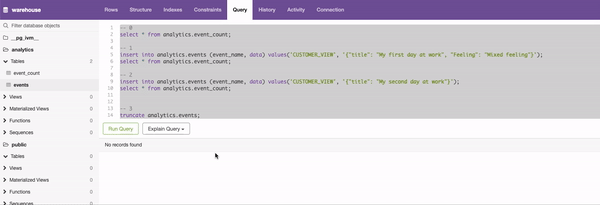

# Awesome Postgres Realtime Materialized Tables
This is a reference implementation of postgres realtime materialized tables using [IVM extension](https://github.com/sraoss/pg_ivm) 

1. It won't work with AWS Aurora Postgres or AWS RDS as they dont support IVM extension yet, [source](https://docs.aws.amazon.com/AmazonRDS/latest/AuroraPostgreSQLReleaseNotes/AuroraPostgreSQL.Extensions.html#AuroraPostgreSQL.Extensions.16) 
2. It works with Self Hosted/managed Postgres, [installation steps](https://github.com/shashanksingh/Awesome-Postgres-Realtime-Materialized-Tables/blob/bfd5c2c1e4cb44c64dfbc7b754d7b2413094d85e/seed/dockerfile#L12) 

## Screenshots

